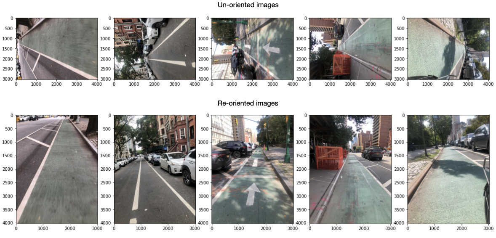

# Stay In Your Lane!

## Automated Bike Lane Enforcement With Neural Network Image Classification

### Author: Jesse Markowitz, October 2021


## The Problem


Biking is my primary mode of transportation around New York City, as it is for an increasing number of people every year. New York City's bike infrastructure rivals that of other cities in the country, but crashes and fatalities still occur and "nearly two-thirds of those who do not bike cite safety concerns as their main reason for not riding more often or at all," according to the [Regional Plan Association](https://rpa.org/work/reports/the-five-borough-bikeway). Clearly there is room to grow when it comes to making cycling in NYC safe and accessible for all. A major safety concern, and the focus of this project, is the high number of cars parked in designated bike lanes. [One study from Hunter College in 2019](http://www.hunter.cuny.edu/communications/repository/files/Bike%20Lanes%20or%20Blocked%20Lanes%20Study.pdf/) found an average of 11.5 blockages per mile of bike lane. On conventional bike lanes, the single greatest cause of these blockages was vehicular obstruction. **Blocked bike lanes force cyclists to weave in and out of traffic, creating serious safety risks.**

In my own experience biking hundreds of miles per year around NYC, not a single trip goes by in which I am not forced to leave the bike lane because of illegally parked or stopped vehicles. Most often, the vehicle is a delivery truck, a police car, or a Taxi and Limousine Commission (T&LC) vehicle, which includes yellow and green cabs, as well as rideshare vehicles for Uber, Lyft, etc. The problem seems to be getting worse, even as more bike lanes are added and more people ride bicycles in NYC each year, yet there seems to be [little interest in enforcement](https://nyc.streetsblog.org/2021/10/21/ignored-dismissed-how-the-nypd-neglects-311-complaints-about-driver-misconduct/). Although the T&LC enforces violators within their ranks by filing summonses for taxi and rideshare drivers in bike lanes (you can help by submitting reports through 311 easily via the [Reported app](https://reportedly.weebly.com/)), but it seems that other drivers are rarely if ever held accountable for parking in the bike lane. This may be related to the fact that the police themselves are some of the worst violators, often using bike lanes as free parking for their personal and service vehicles, expressing [outright hostility](https://nyc.streetsblog.org/2021/10/18/bad-cop-bad-cop-nypd-threatens-tipster-for-filing-311-complaints-about-illegal-parking/) and even [harassment](https://nyc.streetsblog.org/2021/10/19/irony-alert-nypd-threatens-tipster-after-streetsblog-story-about-prior-harassment-over-311-complaints-about-illegal-parking/) toward those who press for accountability. Overall, **insufficient enforcement of bike lane traffic laws creates serious safety issues for cyclists.** 


## Business Understanding

Over the past decade, the number of cyclists on NYC streets has grown at ever increasing rates. According to 2017's [Cycling in the City](http://www.nyc.gov/html/dot/downloads/pdf/cycling-in-the-city.pdf) report from the Department of Transportation (DOT), there were over 178 million cycling trips that year, representing an increase of over 10 million from the year before and showing a 134% growth rate in daily cycling from 2007. This increase is undoubtedly related to the implementation of the CitiBike bike share program in 2013, as well as the hundreds of miles of bike lane infrastructure that have been added to the streets over the past several years. As of 2018, there were over 1,200 miles of bike lanes in the city, with more installed since then. The Covid-19 pandemic also resulted in a [spike in bike ridership](https://www.nytimes.com/2020/03/14/nyregion/coronavirus-nyc-bike-commute.html) as commuters and city-dwellers sought alternatives to crowded public transit. In fact, commuting to work by bike accounts for approximately 20% of all trips; cycling to work has grown fasterin NYC than in any other major city in the country. 


On September 15, 2021, the NYC DOT released a ["Request for Expressions of Interest"](https://a856-cityrecord.nyc.gov/RequestDetail/20210907107) to create a system for automated bike lane enforcement. Although few details have been released about the possible implementation, some are available as Addendums to the official request. For instance, the DOT plans for an enforcement system to "be adatable to both protected and conventional bike lanes," but not shared lanes. The system "should also be capable of 24/7 operation," but "configurable" to operate only at certain days or times. There is no timeline for the project yet, but responses to the request were due on October 18, 2021. (See especially "Addendum 3" posted [here](https://passport.cityofnewyork.us/page.aspx/en/bpm/process_manage_extranet/3992) for more details.)

A system for bus lanes called the Automated Bus Lane Enforcement (ABLE) system and created by [Siemens Mobility](https://www.mobility.siemens.com/us/en/company/newsroom/short-news/first-ever-mobile-bus-lane-enforcement-solution-in-new-york.html) was installed in 2010 and has been expanded since then with great success, as measured by increased route speed and ridership. (The MTA plans to add hundreds more onboard and fixed cameras to bus routes in order to cover 85% of all bus lanes [source](https://www1.nyc.gov/html/dot/html/bicyclists/bikemaps.shtml).) 

Automating enforcement of bike lane traffic laws would increase enforcement from current negligible levels and improve safety for the city's cyclists. Automated enforcement would also reduce the need for active police involvement, providing a more efficient and consistent way to hold drivers accountable.

Last year [at a press conference](https://www.masstransitmag.com/bus/vehicles/press-release/21119742/mta-new-york-city-transit-mta-busmounted-camera-program-begins-issuing-bus-lane-violations-on-b44-sbs-route) on another expansion of the ABLE system, Craig Cipriano, then the "acting MTA Bus Company president and senior vice president for buses of NYC Transit", said, "'Bus lanes are for buses.'" I believe that, through the use of an autmated enforcement system, the same can and will be true for bike lanes. By making sure that bike lanes are free from cars, we can make them safer and more accessible to all.

## Purpose of Analysis

The goal of this project is to take a necessary step toward automating enforcement by building and training a model to identify when a car is parked in a bike lane. The scope of this project is limited to images that are guaranteed to contain a bike lane, based on the idea of an automated enforcement system comprised of stationary cameras placed on streets with bike lanes. The cameras would point up or down the street in order to monitor as much of the length of the bike lane as possible. The image below shows a speed camera used in the city, but illustrates this idea.


Models are evaluated using accuracy and precision (the true-positive rate), as well as an inspection of model decision-making using the [Lime](https://github.com/marcotcr/lime) package. Precision is used to ensure that false-positives are kept to a minimum. 


## Data & Methods

This project required the assembly and processing of an entirely new dataset. The dataset currently consists of just over 1,800 images of New York City bike lanes, up from about 1,600 at the beginning of the project. The small size of the dataset for a task of this nature is one of the most significant limitations of this project. 

The images in the dataset were collected from a variety of sources:
 - The [Reported app's Twitter page](https://twitter.com/Reported_NYC), which tweets all traffic violations reported through the app
 - A large dataset of images provided by [Ryan Gravener](https://github.com/snooplsm), who is working on an image recognition project for Reported
 - Screenshots from Google Maps Street View
 - Manual collection (i.e., taking photos while biking around the city--this is the source of the vast majority of the non-target images of unobstructed bike lanes)

Just over half of these images show a bike lane obstructed by a vehicle, which comprises the target class. The rest of the images show bike lanes without vehicular obstruction, showing entirely empty bike lanes or, on occassion, bike lanes with cyclists or pedestrians. Images were classified manually.

*Note: Although the DOT's request specificies 24/7 enforcement, only daytime images are included in this analysis. Fewer than 150 images initially collected from online sources show a vehicle blocking the bike lane at night, while only a handful of empty bike lane images were taken at night. This creates a significant issue of class-imbalance with a specific subset of images. I was not confident that I would be able to adequately represent nightime bike lanes due to issues with data collection, so for now this project is limited to classification of daytime images.*
 
### Preprocessing

Several steps were taken to prepare images for modeling. First, images collected manually (taken with a smartphone camera) had to be reoriented to ensure they were being fed into the model correctly.



Next, some images had to be cropped. Many images collected via Reported contain timestamps printed at the top of the image, which enhances the photo's value as evidence in a potential hearing. However, this creates potential data leakage and a possible confounding feature in the dataset because images with timestamps will be overrepresented in the target class. Without removing this feature, it's possible that the model will use it to predict the target class, rather than attending to real features in the image.


Many images were deemed unsuitable for training and were removed entirely from the dataset. Images were generally removed that:
 - did not show both lane lines of a bike lane (lines too faint or photo taken too "close up" to a vehicle)
 - showed a bike lane from the side (photo was taken from across the street, facing across the street or toward the sidewalk)
 - contained too many cyclists, motorbikes, or pedestrians such that the bike lane was significantly obstructed
 - were taken at night
 - showed a car in a bike lane legally (i.e., crossing an intersection) or parked in a legally ambiguous zone (i.e., lane lines dashed or too faded to see)
 - were unclear (such as showing a potential vehicular obstruction too far in the distance to tell for sure)
 
The following are a small set of representative examples of the over 200 images that were ultimately removed from the orginal dataset:


Many of these decisions were subjective judgments and there were a surprisingly large number of images that were ambiguous. These images were kept in a separate `unused_images` folder for transparency and possible later inclusion or testing. 

Finally, the image set was split into a training and holdout testing set. Later, more images were added to the corpus and another split was made for validation purposes. This resulted in the following file structure for fully processed images:

This resulted in the following file structure for processed images:

```
└── input_images
    ├── full_combined
    ├── new
    ├── test
    ├── train
    └── validation
```
Each folder of images contains 2 subfolders to designate image classes, as shown below with one example:
```
└── input_images
    ├── full_combined
    │    ├──open_bike_lane
    │    └──vehicle_bike_lane
```

### EDA

Both the validation and holdout test sets contain an even class balance (50 images of each). Effort was made during data collection to keep the class balance in the training set as even as possible. Although there are slightly more target class images, this imbalance was not considered large enough to be a serious issue.


Below are samples of a few images from each class.


The hope is that a neural network, and especially the pattern-detecting filters in a convolutional neural network, will be able to detect the lane lines and vehicle shapes in the images. The images are highly consistent in content and perspective. They are similar both within and between the classes--except for the main feature, a vehicle in the bike lane. Because of this, it seems reasonable that a model could predict the classes with high accuracy, even with a small dataset.

### Modeling

Over 20 models were trained on the data, starting with simple fully connected dense neural networks, progressing through convolutional neural networks, and finally ending with transfer learning models. These powerful models are built using state-of-the-art pre-trained models, such as VGG-16 and InceptionV3, as a base. These models have been trained on the [ImageNet dataset](https://www.image-net.org/), a set of over 14 million images labeled and classified into 1,000 categories.

Although this project is a simple binary classification project, the idea is that these deep models have already learned to recognize many simple and complex patterns through their previous training on millions images of real-world objects. By using not only their complex architecture, but also the pre-tuned weights and hyperparameters for each layer, it's possible to harness that knowledge and apply it to a new task.

The following is a diagram showing the structure of the VGG-16 model. The final three Dense layers were removed, then new Dense layers added on to apply the pre-trained model to this classification task:


Image augmentation was used both to avoid overfitting and to artificially increase the size of the dataset. Image augmentation through the Keras `ImageDataGenerator` is performed randomly and on the fly during model training. This allows the model "see" a variety of images beyond just those in the dataset. It's important to use parameters that the model is likely to see so that the augmented images are still realistic. Parameters were chosen to account for images taken from either side of a street, in a variety of lighting conditions, with a variety of vehicles in the bike lane at a variety of distances from the camera, and at different locations in the frame. Examples of possible augmentation combinations on a single target class image are shown below:


## Results

The final best model chosen for the task has as its base the VGG-16 pre-trained model architecture, topped with several fully connected dense layers. This model out-performed simpler models, as well as models created on an InceptionV3 base, which had higher accuracy overall, but consistently lower preciison. On a validation set, this final VGG-16-based model performed with 94% accuracy and 100% precision, although as the validation set contained only 100 images these metrics were unlikely to remain high on previously unseen data. Sure enough, on the holdout test set, also only 100 images, the model predicted with only 91% accuracy and 91% precision. It is possible that the model is still overfit to the data and would benefit from more regularization strategies, such as l2 regularization or dropout layers. When these techniques were tried on their own, they caused a drop across all metrics, but this could be desireable if it means more consistency in the long run on new images.


Performing above 90% is a great start for a small dataset. I am confident that increasing the size of the dataset to at least 1,000 images per class, as well as trying out more strategies and iterations on the transfer learning model, will result in improved performance on unseen data. Casual testing on nighttime images, which were not used in training, resulted in over 80% accuracy overall and 97% precision on an imbalanced dataset (heavily in favor of the target class). This suggests that the model is generalizable and supports the idea that it can improve with more training on more data. The use case for this model would also allow for continued training and improvement over time as more images are collected during its use and reviewed manually.


## Conclusion

### Recommendations

New York City needs automated bike lane enforcement. The bike lanes are too often treated as free parking for the city's drivers, especially by delivery vehicles, taxis, and police vehicles. This causes dangerous conditions for the ever-increasing number of cyclists on the streets who depend on bike lanes to provide a safer, vehicle-free corridor. When vehicles are stopped in the bike lane, it forces cyclists to merge into traffic and weave around cars, putting them at risk of fatal injury.

Automated enforcement would increase the efficiency and consistency of ticketing, as well as reduce the need for police to actively engage with drivers. This would save time and human resources, and likely save money as well. I recommend starting with stationary cameras, pointing down bike lanes on long, straight streets or avenues that are largely free from other obstructions. Historic data from the Reported app could be used to identify and locate especially problematic areas in which bike lanes are consistently clogged. Several locations around the city have bike lanes I have never been able to actually use because they are always filled with parked cars.

This is a manageable, if not preventable issue. The Department of Transportation reported that installing the ABLE system on bus lines increased bus route speeds and ridership; they are working to expand the system to cover over 85% of all NYC bus routes. Creating an analogous system for bike lanes would increase safety for bike commuters and anyone else who cycles in the city.

### Possible Next Steps

To improve the model, the best and most important next step is to collect more data. Beyond that, there are several possible avenues to take:
 - Add additional classes to identify in the bike lane, including bikes, motorbikes, or other types of vehicles
 - Move to object *detection* rather than just image classification in order to identify and locate only vehicles in the image that are blocking the bike lane
 - Incorporate Automatic License Plate Recognition (APLR) for automated ticketing and look into options for connecting for existing enforcement systems, like ABLE or red light/speed cameras in the city
 - Connect my model to the Reported app to assist in its development

## For More Information

See the full analysis in the [Jupyter Notebook](nyc_bike_lanes.ipynb) or review this [presentation](nyc_bike_lanes_presentation.pdf). The full image dataset, as well as trained models, are available by request.

### Structure of Repository:

```
├── code (working notebooks, named by stage of project)
├── input_images (dataset used in training models)
├── models (saved .h5 files of trained models and pickled training histories)
├── other images (unused and not fully processed images)
├── nyc_bike_lanes.ipynb
├── nyc_bike_lanes_presentation.pdf
├── functions.py (custom functions)
├── model_tracker.csv
└── README.md
```
