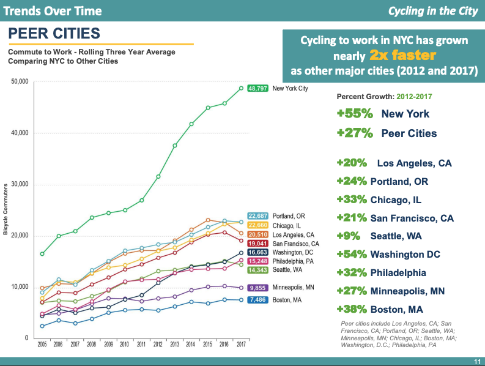
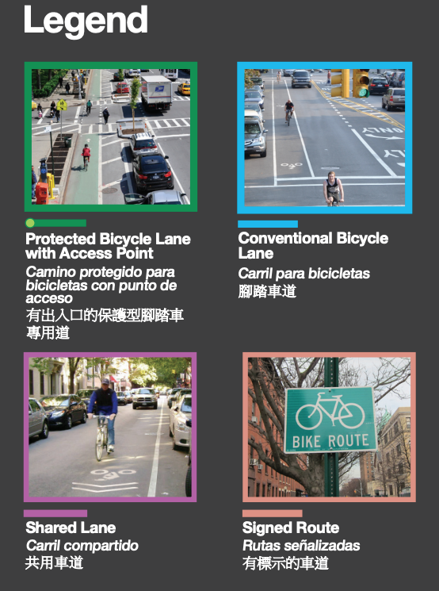

# Stay In Your Lane!

## Automated Bike Lane Enforcement With Neural Network Image Classification

### Author: Jesse Markowitz, October 2021


## The Problem


Biking is my primary mode of transportation around New York City, as it is for an increasing number of people every year. Although NYC's bike infrastructure rivals that of other cities in the country, crashes and fatalities still occur, and "nearly two-thirds of those who do not bike cite safety concerns as their main reason for not riding more often or at all." [source](https://rpa.org/work/reports/the-five-borough-bikeway) Clearly there is room to grow when it comes to making cycling in NYC safe and accessible to all. A major safety concern, and the focus of this project, is the high number of cars parked in designated bike lanes. [One study from Hunter College in 2019](http://www.hunter.cuny.edu/communications/repository/files/Bike%20Lanes%20or%20Blocked%20Lanes%20Study.pdf/) found an average of 11.5 blockages per mile of bike lane. On conventional bike lanes, the single greatest cause of these blockages was vehicular obstruction. A blocked bike lane means that cyclists are forced to weave in and out of traffic, creating a significant risk to their safety.

In my own experience biking hundreds of miles per year in the city, not a single trip goes by in which I am not forced to leave the bike lane because it is blocked by a vehicle. Most often, the vehicle is a Taxi and Limousine Commission (T&LC) car (yellow and green cabs, as well as rideshare vehicles for Uber, Lyft, etc.), a delivery truck, or a police car. And the problem seems to be getting worse, even as more bike lanes are added and more people ride in NYC, and there seems to be little interest in enforcement. **Insufficient enforcement of bike lane traffic laws creates serious safety issues for cyclists.**


## Business Understanding

Over the past decade, the number of cyclings on NYC streets has grown at ever increasing rates. According to 2017's [Cycling in the City](http://www.nyc.gov/html/dot/downloads/pdf/cycling-in-the-city.pdf) report from the Department of Transportation (DOT), there were over 178 million cycling trips that year, representing an increase of over 10 million from the year before and showing a 134% growth rate in daily cycling from 2007. This increase is undoubtedly both cause and effect of the implementation of the CitiBike bike share program in 2013, as well as the hundreds of miles of bike lane infrastructure that has been added to the streets over the past several years. As of 2018, there were over 1,200 miles of bike lanes in the city, with more installed since then. The covid-19 pandemic also resulted in a [spike in bike ridership](https://www.nytimes.com/2020/03/14/nyregion/coronavirus-nyc-bike-commute.html) in NYC as commuters and city dwellers sought alternatives to crowded public transit. Commuting to work by bike accounts for approximately 20% of all trips in NYC; cycling to work in the city has grown faster than in any other major city in the country. 


(For the full map, visit https://www1.nyc.gov/html/dot/html/bicyclists/bikemaps.shtml)

There are four types of official signed bike routes in NYC, but only two of them are officially designated as lanes. Some are considered "protected," which means there is some sort of barrier or buffer zone between the lane and moving traffic. Most often, protected bike lanes are placed between the sidewalk and an area of parallel parking, but they may also be designated with flimsy plastic posts (often called "flexis" or "flexiposts"). Sometimes there is simply a painted buffer zone keeping traffic at bay. Protected bike lanes are also usually filled in with green paint, as well as white bike symbols.

Conventional bike lanes are located in the road, between vehicular traffic lanes and parking or sidewalks. There are no physical barriers or space, but the lanes are painted on the road with white lane lines and bike symbols. This is the type of lane the Hunter study identified as most likely to be blocked by a vehicle, which is in line with my own experience as well.



On September 15, 2021, the NYC DOT released a ["Request for Expressions of Interest"](https://a856-cityrecord.nyc.gov/RequestDetail/20210907107) to create a system for automated bike lane enforcement. A system for bus lanes called the Automated Bus Lane Enforcement (ABLE) system was created by [Siemens Mobility](https://www.mobility.siemens.com/us/en/company/newsroom/short-news/first-ever-mobile-bus-lane-enforcement-solution-in-new-york.html) and installed in 2010 and has been expanded since then with great success, as measured by increased route speed and ridership. (In fact, the MTA plans to add hundreds more onboard and fixed cameras to bus routes to increase enforcement to 85% of all bus lanes [source](https://www1.nyc.gov/html/dot/html/bicyclists/bikemaps.shtml).) 

Automating enforcement of bike lane traffic laws would have the immediate effect of increase enforcement from what seem to be negligible levels. The T&LC enforces violators within their ranks by filing summonses for taxi and rideshare drivers in bike lanes (you can help by submitting reports through 311 easily via the [Reported NYC app](https://reportedly.weebly.com/)), but it seems that other drivers are rarely if ever held accountable for parking in the bike lane. This may be related to the fact that the police themselves are some of the worst violators, often using bike lanes as free parking for their personal and service vehicles, and [hostile to those who ask](https://nyc.streetsblog.org/2021/10/18/bad-cop-bad-cop-nypd-threatens-tipster-for-filing-311-complaints-about-illegal-parking/) them to follow the laws they are meant to enforce. Automated enforcement would also benefit the city's cyclists by reducing the need for active police involvement, especially on streets where the problem is the greatest.

Last year [at a press conference](https://www.masstransitmag.com/bus/vehicles/press-release/21119742/mta-new-york-city-transit-mta-busmounted-camera-program-begins-issuing-bus-lane-violations-on-b44-sbs-route) on another expansion of the ABLE system, Craig Cipriano, then the "acting MTA Bus Company president and senior vice president for buses of NYC Transit", said, "'Bus lanes are for buses.'" I believe that the same can and will be true for bike lanes. By making sure that bike lanes are free from cars, we can make them safer and more accessible to all.

## Purpose of Analysis


## Data & Methods


## Results


## Conclusion

### Recommendations


### Possible Next Steps


## For More Information

See the full analysis in the [Jupyter Notebook](./NYC_bike_lanes.ipynb) or review this [presentation](./NYC_bike_lanes_presentation.pdf)

### Structure of Repository:

```
├── working_nbs (working notebooks, named by stage of project)
├── input_images (dataset used in training models)
├── models (saved .h5 files of trained models and pickled training histories)
├── other images (unused and not fully processed images)
├── nyc_bike_lanes.ipynb
├── nyc_bike_lanes_presentation.pdf
├── functions.py (custom functions)
└── README.md
```
